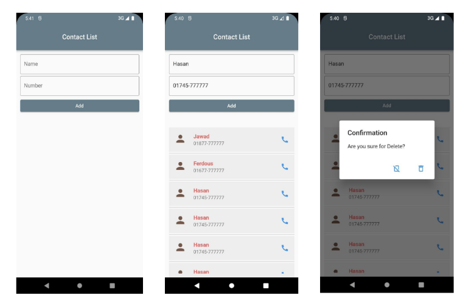

# মডিউল ১০ এর এসাইনমেন্ট

## Implement this UI by flutter code. There are 2 input fields where one can take the name and other can take the number. When pressing on the ‘add’ button your data has to show in a list tile just like the picture. Also add a confirmation dialogue for deletion when pressing a long tap on the list. 

